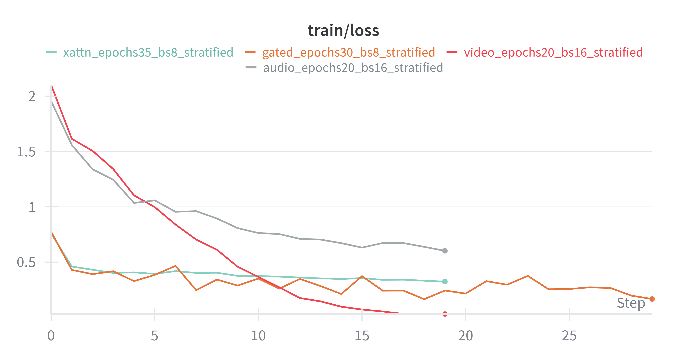
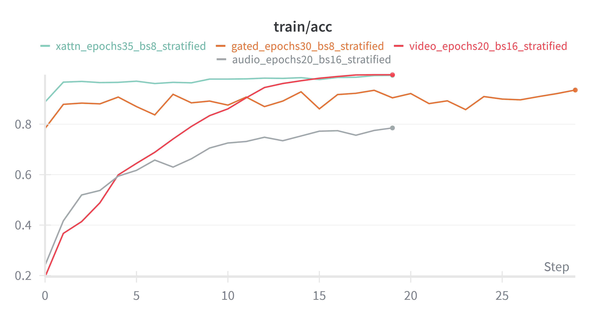
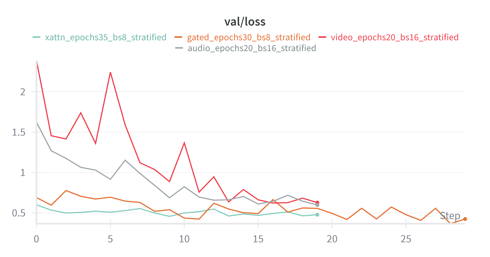
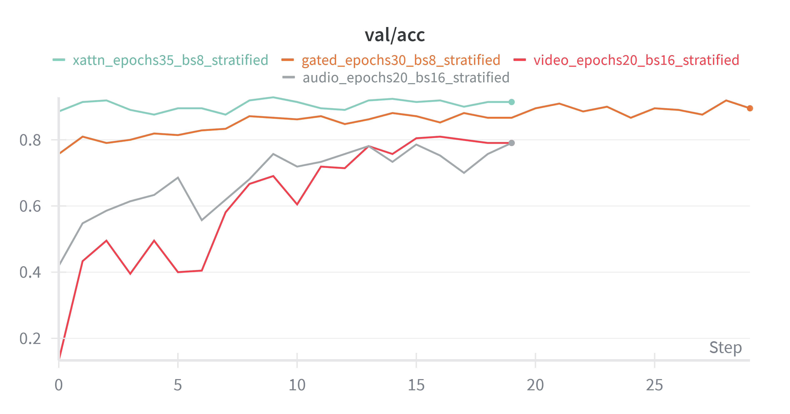
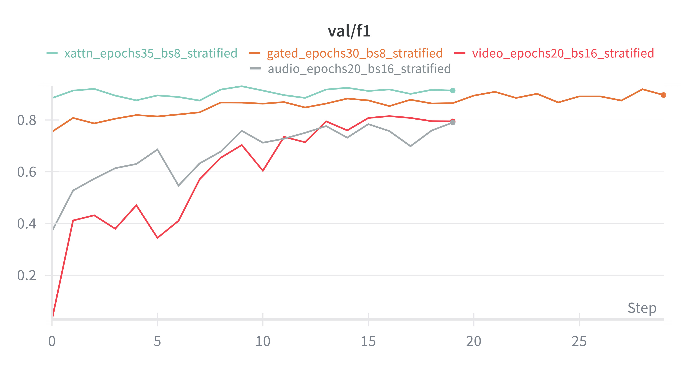
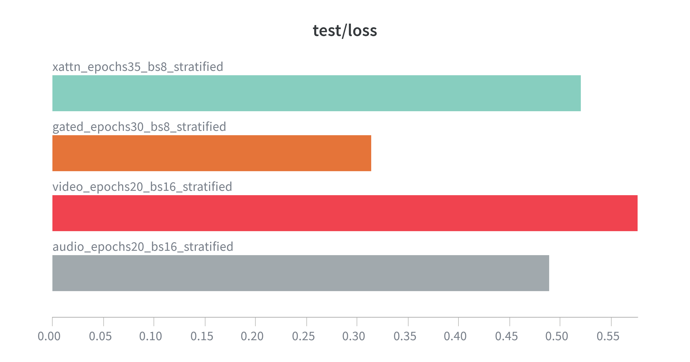
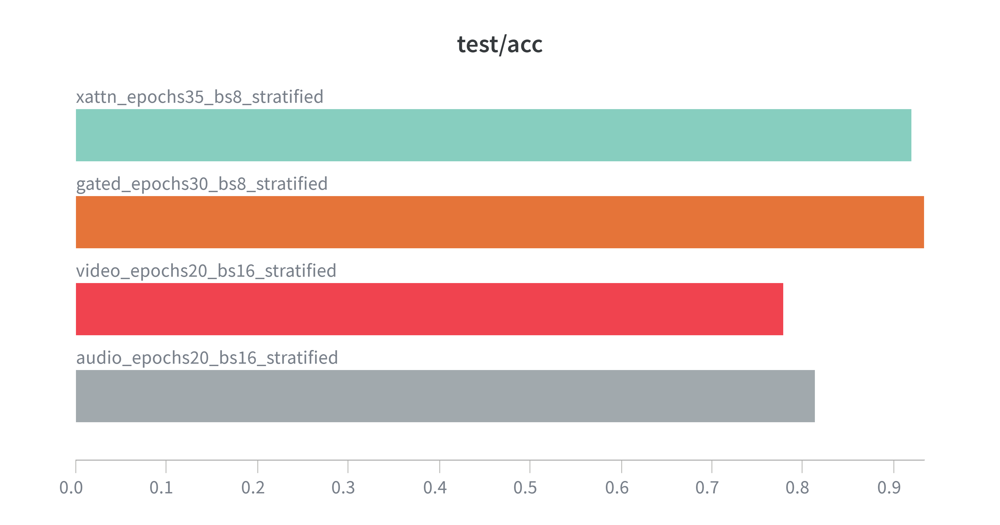
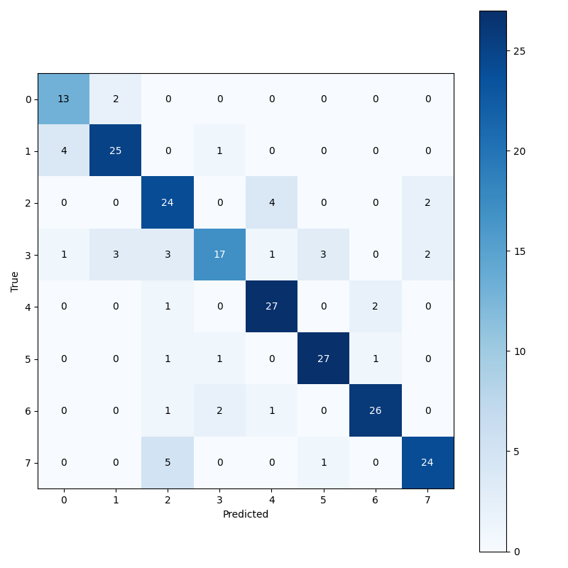
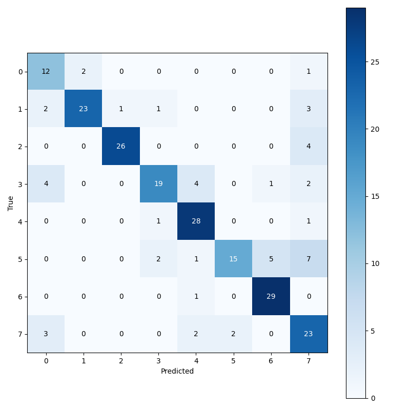
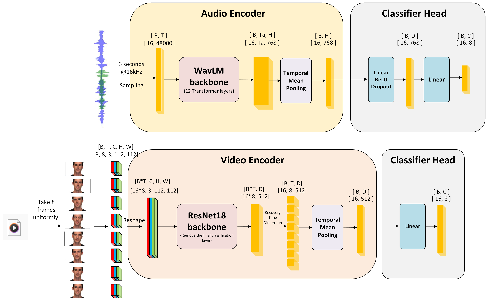

# Multimodal Emotion Recognition

Audio-visual emotion recognition system using PyTorch and Docker. Recognizes 8 emotions from video and audio using deep learning fusion models.

## Quick Start (Docker)

```bash
# 1. Start services (requires Docker)
docker compose up --build

# 2. Open browser and navigate to
http://localhost:8080

# 3. Record 3-second video, click "Predict Emotion"
# Results show emotion probabilities and top prediction
```

**Note**: First run uses mock predictions. To use trained model:
```bash
mkdir checkpoints
# Copy your best.pt to checkpoints/best.pt
docker compose up --build
```

## Features

- **Audio Encoder**: WavLM pretrained model with two-stage finetuning (freeze backbone → unfreeze last layers)
- **Fusion Warm-Start**: Load `best_audio.pt` + `best_video.pt` into fusion branches for faster and stabler convergence
- **Two-Stage Gated Fusion**: Stage-1 frozen encoders + Stage-2 selective unfreeze with layer-wise learning rates
- **Multimodal Input**: Process both video and audio simultaneously with face detection & cropping
- **Fusion Strategies**: Late, Concat, Gated, and Cross-Attention (xAttn) fusion methods
- **Real Noise Augmentation**: Bar noise augmentation with SNR control (5-20 dB) using time-domain fusion
- **Curriculum Learning**: Probability distribution strategy (50% clean, 40% light/medium noise, 10% heavy noise)
- **Data Augmentation**: Video (blur, darken, noise) + Audio (real bar noise injection)
- **Face Detection**: MediaPipe-based face cropping with 30% padding to prevent background learning
- **Web UI**: Browser-based video recorder with flipped preview for real-time emotion prediction
- **REST API**: FastAPI backend with `/health` and `/predict` endpoints
- **Docker Deployment**: Complete containerized stack (Backend, Frontend, optional vLLM)
- **Mock Mode**: Test without trained checkpoint (for development)
- **Experiment Tracking**: Weights & Biases integration for training metrics

## Showcase Placeholders

Use this section to display processed data examples, W&B comparisons, and your custom architecture diagram.

### 1) Processed Data Examples (Audio + Video)

Video example :

<video controls width="720" src="assets/examples/processed_video_example.mp4">
  Your browser does not support the video tag.
</video>

Audio example :

<audio controls src="assets/examples/processed_audio_example.wav">
  Your browser does not support the audio element.
</audio>

Alternative links :
- [Processed Video Example](assets/examples/processed_video_example.mp4)
- [Processed Audio Example](assets/examples/processed_audio_example.wav)

### 2) W&B Charts: 3-Run Comparison Dashboard

This section is designed for your current chart format:
- each figure contains curves from **3 runs**
- each run includes **audio / video / multimodal** types in the same chart


Train metrics (3 runs x 3 types in each figure):

| Loss | Accuracy | Macro-F1 |
|---|---|---|
|  |  |  |

Validation metrics (3 runs x 3 types in each figure):

| Loss | Accuracy | Macro-F1 |
|---|---|---|
|  |  |  |

Test metrics (3 runs x 3 types in each figure):

| Loss | Accuracy | Macro-F1 |
|---|---|---|
|  |  |  |

Confusion matrices (best checkpoints or representative runs):

| Audio | Video | Multimodal |
|---|---|---|
|  |  |  |

### 3) Custom Model Architecture Diagram

Recommended path:
- `assets/diagrams/model_architecture_overview.png`



Optional caption template:
> Figure: Your custom architecture diagram (replace with final version exported from your drawing tool).

## Project Structure

```
.
├── main.py                    # Entry point
├── pyproject.toml             # Poetry configuration
├── README.md                  # This file
├── docker-compose.yml         # Docker Compose orchestration
├── assets/
│   ├── examples/              # README demo media (processed audio/video)
│   ├── wandb/                 # README chart screenshots/exports
│   └── diagrams/              # README architecture diagrams
├── src/
│   ├── train.py               # Training loop with WavLM, face crop, augmentation
│   ├── eval.py                # Evaluation script
│   ├── data/
│   │   └── ravdess.py         # RAVDESS dataset loader (bar noise augmentation)
│   ├── models/
│   │   ├── audio.py           # Audio branch (CNN)
│   │   ├── video.py           # Video branch (ResNet18)
│   │   ├── wavlm_audio.py     # WavLM audio encoder (NEW)
│   │   └── fusion.py          # Fusion strategies
│   └── utils/
│       ├── metrics.py         # Evaluation metrics
│       ├── face_crop.py       # Face detection & cropping (NEW)
│       └── seed.py            # Reproducibility
├── backend/
│   ├── Dockerfile             # Backend container image
│   ├── requirements.txt        # Python dependencies
│   └── app/
│       ├── main.py            # FastAPI app
│       ├── config.py          # Configuration constants
│       ├── preprocess.py      # Video/audio preprocessing with face crop
│       ├── model_loader.py    # Checkpoint loading
│       └── infer.py           # Inference pipeline
├── frontend/
│   ├── Dockerfile             # Frontend container (nginx)
│   ├── nginx.conf             # Nginx configuration
│   ├── index.html             # Main UI page
│   ├── app.js                 # MediaRecorder & API calls (video flipped)
│   └── style.css              # Styling (video scaleX transform)
├── data/
│   ├── Actor_01/ ... Actor_24/# RAVDESS dataset (24 actors)
│   └── Noise/
│       └── noise.wav          # Bar background noise (NEW)
└── checkpoints/               # Trained model weights
    └── best.pt                # Checkpoint for inference
```

## Requirements

### System
- Docker Engine / Docker Desktop
- 8GB RAM minimum
- GPU optional (NVIDIA CUDA in WSL2/Linux)

### Python (for local training)
- Python 3.10+
- CUDA-enabled PyTorch (if using GPU)
- ffmpeg (for video/audio processing)

## Installation & Setup

### Option 1: Docker (Recommended)

1. **Install Docker** for your OS:
   - Windows: https://www.docker.com/products/docker-desktop
   - Mac: https://www.docker.com/products/docker-desktop
   - Linux: Follow official Docker docs

2. **Clone/Download** project files

3. **Prepare trained checkpoint** (optional):
   ```bash
   mkdir checkpoints
   # Copy your best.pt here or use EMO_MOCK=1 for mock predictions
   ```

4. **Start services**:
   ```bash
   cd /path/to/project
   docker compose up --build
   ```

5. **Access web UI**:
   - Open browser → `http://localhost:8080`
   - Record 3-second video
   - Click "Predict Emotion" to see results

### Option 2: Local Python Setup

1. **Install Python 3.10+** and ffmpeg

2. **Install project dependencies**:
   ```bash
   pip install -r backend/requirements.txt
   ```

3. **Train model** (on RAVDESS data):
   ```bash
   python src/train.py \
     --data_root data \
     --fusion gated \
     --use_wavlm \
     --epochs 30 \
     --batch_size 8 \
     --early_stopping_patience 8 \
     --wandb
   ```

4. **Run backend locally**:
   ```bash
   cd backend
   export USE_GPU=0  # or 1 for GPU
   export EMO_MOCK=0  # 1 for mock predictions without checkpoint
   uvicorn app.main:app --host 0.0.0.0 --port 8000 --reload
   ```

5. **Run frontend locally**:
   - Serve `frontend/` with any HTTP server:
   ```bash
   cd frontend
   python -m http.server 8080
   ```
   - Open `http://localhost:8080`
   - Optional custom backend URL:
   ```
   http://localhost:8080/?backend=http://localhost:8000
   ```

### WSL Notes (Important)

- Keep project/data in Linux filesystem when possible (`/home/<user>/...`), not `/mnt/c/...`, for better training I/O performance.
- `src/train.py` now uses WSL-aware DataLoader defaults automatically.
- You can override worker count manually:
```bash
python src/train.py --data_root data --fusion xattn --num_workers 2
```
- Backend now uses absolute project paths, so running from different working directories in WSL is supported.

## Usage

### Web UI (Easiest)

1. Click **"Start Recording"** → Webcam access permission prompt
2. Record 3 seconds (auto-stops)
3. Click **"Predict Emotion"**
4. View emotion probabilities and top prediction

### API Endpoint

```bash
# Health check
curl http://localhost:8000/health

# Predict emotion from video file
curl -X POST http://localhost:8000/predict \
  -F "file=@video.webm"
```

**Response**:
```json
{
  "labels": ["neutral", "calm", "happy", "sad", "angry", "fearful", "disgust", "surprised"],
  "probs": [5.2, 8.3, 15.1, 12.8, 20.5, 10.2, 18.9, 9.0],
  "top1": {
    "label": "angry",
    "prob": 20.5
  }
}
```

### Training

#### Dataset

Download RAVDESS dataset:
```bash
# Place extracted data in data/
# Structure:
# data/
#   Actor_01/
#     03-01-01-01-01-01-01.mp4  (emotion, intensity, statement, repetition, actor)
#   ...
#   Actor_24/
```

#### Training with WavLM + Face Crop + Real Noise Augmentation

```bash
# Stage 1: Freeze WavLM backbone, train classifier head
python src/train.py \
  --data_root data \
  --fusion audio \
  --use_wavlm \
  --wavlm_stage 1 \
  --epochs 20 \
  --batch_size 16 \
  --use_face_crop \
  --use_cosine_annealing \
  --wandb

# Stage 2: Unfreeze last 2 layers, finetune with lower backbone LR
python src/train.py \
  --data_root data \
  --fusion audio \
  --use_wavlm \
  --wavlm_stage 2 \
  --backbone_lr 3e-5 \
  --epochs 20 \
  --batch_size 16 \
  --use_face_crop \
  --use_cosine_annealing \
  --wandb
```

#### With Stratified Split (Multimodal Fusion)

```bash
# Warm-start xAttn fusion from trained single-modality checkpoints
python src/train.py \
  --data_root data \
  --num_classes 8 \
  --fusion xattn \
  --xattn_head gated \
  --xattn_d_model 96 \
  --xattn_heads 4 \
  --xattn_attn_dropout 0.1 \
  --xattn_stochastic_depth 0.1 \
  --label_smoothing 0.05 \
  --use_wavlm \
  --audio_ckpt outputs/best_audio.pt \
  --video_ckpt outputs/best_video.pt \
  --two_stage_training \
  --stage1_epochs 6 \
  --fusion_unfreeze_wavlm_layers 2 \
  --fusion_unfreeze_video_blocks 1 \
  --lr 2e-4 \
  --audio_backbone_lr 8e-6 \
  --video_backbone_lr 8e-6 \
  --split_mode stratified \
  --train_ratio 0.75 \
  --val_ratio 0.15 \
  --epochs 35 \
  --batch_size 8 \
  --weight_decay 2e-4 \
  --use_face_crop \
  --use_cosine_annealing \
  --early_stopping_patience 10 \
  --wandb
```

#### Key Arguments

| Argument | Default | Notes |
|----------|---------|-------|
| `--fusion` | `audio` | `audio`, `video`, `late`, `concat`, `gated`, `xattn`, `xattn_concat`, `xattn_gated` |
| `--use_wavlm` | `False` | Use WavLM pretrained audio encoder (vs CNN) |
| `--wavlm_stage` | `1` | WavLM training stage: 1 (freeze) or 2 (unfreeze) |
| `--backbone_lr` | `3e-5` | Learning rate for WavLM backbone in stage 2 |
| `--xattn_head` | `concat` | xAttn fusion head: `concat` or `gated` |
| `--xattn_d_model` | `128` | xAttn hidden size |
| `--xattn_heads` | `4` | Number of xAttn heads |
| `--xattn_attn_dropout` | `0.1` | Attention dropout in xAttn MHA |
| `--xattn_stochastic_depth` | `0.1` | Drop-path on xAttn residual branches |
| `--label_smoothing` | `0.0` | Label smoothing for non-late CrossEntropy training |
| `--audio_ckpt` | `""` | Warm-start fusion audio branch from standalone audio checkpoint |
| `--video_ckpt` | `""` | Warm-start fusion video branch from standalone video checkpoint |
| `--two_stage_training` | `False` | Enable two-stage fusion training |
| `--stage1_epochs` | `5` | Stage-1 epochs when two-stage fusion is enabled |
| `--audio_backbone_lr` | `1e-5` | Stage-2 LR for audio encoder params in fusion |
| `--video_backbone_lr` | `1e-5` | Stage-2 LR for video encoder params in fusion |
| `--fusion_unfreeze_wavlm_layers` | `2` | Stage-2 unfreezes last N WavLM layers in fusion |
| `--fusion_unfreeze_video_blocks` | `1` | Stage-2 unfreezes last N video backbone blocks in fusion |
| `--fusion_unfreeze_audio` | `True` | Stage-2 unfreeze switch for non-WavLM audio encoder |
| `--no_fusion_unfreeze_audio` | - | Keep non-WavLM audio encoder frozen in Stage-2 |
| `--use_face_crop` | `True` | Enable face detection & cropping (default enabled) |
| `--split_mode` | `stratified` | `actor` (by actor) or `stratified` (by emotion) |
| `--train_ratio` | `0.7` | Train ratio when `--split_mode stratified` |
| `--val_ratio` | `0.15` | Validation ratio when `--split_mode stratified` |
| `--weight_decay` | `1e-4` | L2 regularization |
| `--early_stopping_patience` | `10` | Epochs without improvement before stopping |
| `--use_cosine_annealing` | `False` | Use cosine annealing LR scheduler |
| `--wandb` | `False` | Enable Weights & Biases logging |
| `--no_face_crop` | - | Disable face detection & cropping |
| `--num_workers` | `-1` | Auto-tuned for OS/WSL; set `0/1/2...` to force |

## Model Architecture

### Video Branch
- **Backbone**: ResNet18 (ImageNet pretrained)
- **Preprocessing**: 
  - 8 frames uniformly sampled from 3-second video
  - **Face Detection & Cropping** (MediaPipe): Detect face in frame 0, crop with 30% padding (prevents background shortcuts)
  - Resize to 112×112 RGB, ImageNet-normalize
- **Data Augmentation** (training only): Blur, darken, Gaussian noise
- **Output**: 512-dim embedding per frame

### Audio Branch (Two Options)

**Option 1: CNN (Default)**
- **Input**: 3-second audio @ 16kHz (mono)
- **Feature**: Log-mel-spectrogram (64 mels, hop_length=160)
- **Encoder**: 2-layer CNN → 512-dim embedding
- **Output**: Per-timestep embeddings [Ta, 512]

**Option 2: WavLM (Recommended)** ⭐
- **Backbone**: Microsoft WavLM-base (768-dim hidden)
- **Input**: Raw waveform @ 16kHz, 3-second duration
- **Preprocessing**: 
  - **Real Bar Noise Augmentation** (training): Time-domain fusion with 50/40/10 probability distribution:
    - 50% clean audio (original)
    - 40% light/medium noise (SNR ∈ {20, 15, 10} dB)
    - 10% heavy noise (SNR = 5 dB)
  - Loaded from `data/Noise/noise.wav` with global caching
- **Training**: Two-stage finetuning
  - **Stage 1**: Freeze WavLM backbone, train linear head (lr=1e-3)
  - **Stage 2**: Unfreeze last 2 layers (backbone_lr=3e-5, head_lr=1e-3)
- **Output**: 512-dim embedding (after projection from 768-dim)

### Data Augmentation Strategy

**Probability Distribution** (curriculum learning approach):
- 50% **Clean**: Original, unaugmented audio/video (easy learning)
- 40% **Light/Medium**: Moderate noise injection (medium difficulty)
- 10% **Heavy**: Strong noise (hard learning)

**Video Augmentation**:
- Gaussian blur, brightness reduction, pixel noise (training only)

**Audio Augmentation** (when noise applied):
- Real bar background noise (SNR-controlled time-domain mixing)
- Formula: `y(t) = s(t) + α·n(t)` where α is scaled by target SNR

### Fusion Methods

1. **Late Fusion**: Softmax average of video and audio logits
2. **Concat Fusion**: Concatenate embeddings [video; audio] → MLP classifier
3. **Gated Fusion**: Learned gating: `output = w*video + (1-w)*audio`
4. **Cross-Attention (xAttn)**: Bidirectional multi-head attention between video and audio sequences
   - Video query attends to audio (v2a)
   - Audio query attends to video (a2v)
   - Residual connections + LayerNorm + StochasticDepth
   - Attention dropout in MHA + optional label smoothing in loss
   - Fusion head: concat or gated

## Advanced Features

### Real Noise Augmentation (Bar Domain Adaptation)

The system uses real bar background noise for domain adaptation to noisy venues:

- **Noise Source**: `data/Noise/noise.wav` (bar/crowd ambient background)
- **SNR Range**: 5-20 dB (5=very noisy, 20=nearly clean)
- **Time-Domain Fusion**: Direct waveform mixing (not frequency-domain)
- **Probability Distribution**:
  - 50% clean (no augmentation)
  - 40% light/medium noise (SNR: 20, 15, or 10 dB)
  - 10% heavy noise (SNR: 5 dB)

**Why This Works**:
1. Clean samples let model learn base emotion patterns
2. Medium noise provides robustness without overfitting
3. Heavy noise forces generalization to challenging conditions
4. Mimics real bar environment where noise varies

**References**: See `AUGMENTATION_STRATEGY_DISTRIBUTION.md` for detailed curriculum learning rationale.

### Face Detection & Cropping

Automatic face detection prevents the model from using background context:

- **Detector**: MediaPipe FaceMesh (with graceful fallback)
- **Strategy**: Detect face in first frame, reuse bounding box for all frames
- **Padding**: 30% around detected face region
- **Effect**: Forces model to learn emotion from facial expressions, not scene

**To disable**: Use `--no_face_crop` flag in training

## Environment Variables

| Variable | Default | Purpose |
|----------|---------|---------|
| `EMO_MOCK` | `0` | Set to `1` to run with random predictions (for testing without checkpoint) |
| `USE_GPU` | `0` | Set to `1` to enable CUDA device |
| `CHECKPOINT_PATH` | `./checkpoints/best.pt` | Path to trained model weights |

### Example: Run Backend in Mock Mode

```bash
# Docker
docker compose up -e EMO_MOCK=1

# Local
export EMO_MOCK=1
uvicorn app.main:app --host 0.0.0.0 --port 8000
```

## vLLM Service

The `docker-compose.yml` includes an optional vLLM OpenAI API server for language model tasks (not used by emotion classifier).

**Note**: vLLM requires significant resources. To disable:
```yaml
# In docker-compose.yml, comment out the vllm service
# or run: docker compose up --profile=no-vllm
```

**Access** (if enabled):
```bash
curl http://localhost:8001/v1/models
```

## Performance

### Emotion Classes
8-class emotion recognition: **Neutral**, **Calm**, **Happy**, **Sad**, **Angry**, **Fearful**, **Disgust**, **Surprised**

### Typical Results (Stratified Split)

**CNN Audio + Late Fusion** (baseline):
- Train Accuracy: ~78-82%
- Val Accuracy: ~68-72%
- Test Accuracy: ~68-72%

**WavLM Audio + Gated Fusion Warm-Start (recommended)**:
- Train Accuracy: ~85-90%
- Val Accuracy: ~72-78%
- Test Accuracy: ~72-78%
- **Robustness to noise**: +8-12% improvement on noisy test data

*Note: Results vary based on fusion method, face crop, augmentation strategy, and random seed. Use `--seed 42` for reproducibility.*

## Testing & Validation

### Verify Data Augmentation

```bash
# Test bar noise loading and augmentation
python test_bar_noise_augment.py

# Test augmentation probability distribution
python test_probability_direct.py

# Output: Confirms 50/40/10 split with 1000 samples ✓
```

### Verify Face Detection

```bash
# Test MediaPipe integration
python -c "from src.utils.face_crop import get_face_detector; \
detector = get_face_detector(); \
print('Face detector ready:', detector is not None)"
```

### Training Sanity Check

```bash
# Quick training run on 2 epochs (no checkpoint required)
python src/train.py \
  --data_root data \
  --fusion audio \
  --use_wavlm \
  --wavlm_stage 1 \
  --epochs 2 \
  --batch_size 4 \
  --use_face_crop
```

## Troubleshooting

### Backend not accessible from frontend

1. Ensure backend is running: `docker logs emotion_backend`
2. Check frontend CORS: Backend has `allow_origins=["*"]`
3. Verify ports: Backend=8000, Frontend=8080

### "Checkpoint not found" error

1. Place trained model at `./checkpoints/best.pt`
2. Or run with `EMO_MOCK=1` for testing: `docker compose up -e EMO_MOCK=1`

### Docker build fails on Windows

1. Ensure file endings are LF (not CRLF) in shell scripts
2. Use PowerShell or WSL2 terminal
3. Clear Docker cache: `docker system prune`

### CUDA out of memory

1. Reduce batch size: `--batch_size 4`
2. Run on CPU: `export USE_GPU=0`
3. Use simpler fusion: `--fusion late`

### MediaPipe import errors (face_crop.py)

The system automatically falls back to graceful degradation:
- Modern MediaPipe tasks API → Legacy tasks API → No face detection (all frames processed as-is)

If you see warnings, it's safe to ignore—the model will still train/infer without face cropping.

### WavLM slow first time

First inference with WavLM downloads the model (~1.5 GB). This happens once during Stage 1 training. Subsequent runs use cached weights.

## Weights & Biases Integration

Track experiments with wandb:

```bash
python src/train.py \
  --wandb \
  --data_root data \
  --fusion gated \
  --use_wavlm \
  --epochs 30 \
  --batch_size 8
```

Logs:
- Train/Val/Test metrics (loss, accuracy, F1, precision, recall)
- Learning rate schedule
- Confusion matrix (validation)
- System metrics (GPU/CPU utilization)

View online at: https://wandb.ai/

## Citation

**RAVDESS Dataset**:
```bibtex
@article{livingstone2018ryerson,
  title={The ryerson audio-visual emotion database (RAVDESS): A dynamic resource for emotion research},
  author={Livingstone, Steven R and Russo, Frank A},
  journal={PLoS ONE},
  volume={13},
  number={5},
  pages={e0196424},
  year={2018},
  publisher={Public Library of Science San Francisco, CA USA}
}
```

## License

[Your License Here]

## Contact

For issues or questions, open an issue on the project repository.
