# Multimodal Emotion Recognition System

Audio-Visual Emotion Recognition using Deep Learning and Cross-Modal Fusion

## 项目简介

本项目实现了一个完整的音视频多模态情感识别系统，能够从 3 秒视频中联合分析：

- 人脸表情（视觉模态）
- 语音情感特征（音频模态）

并预测以下 8 类情绪：

- neutral
- calm
- happy
- sad
- angry
- fearful
- disgust
- surprised

系统支持：

- 单模态训练（audio / video）
- 多模态融合训练
- 实时推理 API
- Web 端实时预测
- Docker 部署

## 项目亮点（面试核心）

### 1. 多模态深度学习架构设计

实现完整双模态 emotion recognition pipeline：

视觉模态：

- ResNet18 backbone（ImageNet pretrained）
- MediaPipe 人脸检测与裁剪
- 时间维特征聚合

音频模态：

- WavLM pretrained speech model
- 两阶段 finetuning 策略：
  - Stage 1: freeze backbone
  - Stage 2: selective unfreeze

输出 embedding：

- Video embedding: `[B, T, 512]`
- Audio embedding: `[B, Ta, 768]`

### 2. Cross-Attention 跨模态融合（核心创新）

实现 bidirectional cross-attention fusion：

- Video -> attends -> Audio
- Audio -> attends -> Video

结构：

- Video features -> MHA(query=video, key=audio)
- Audio features -> MHA(query=audio, key=video)

实现包含：

- Multi-Head Attention
- residual connection
- layer normalization
- stochastic depth regularization

该结构允许模型：

- 学习 audio-visual correlation
- 在实验中优于简单 concat 或 late fusion

进一步扩展：

- 支持在 cross-attention 后继续做 temporal pooling / temporal transformer 聚合
- 支持加入 emotion-prior-conditioned attention bias：
  - 先由全局音视频表示生成 emotion prior
  - 再为 query / key token 生成 token-wise bias
  - 注意力形式为 `softmax(QK^T + bias_emotion)`
- 该模块与主体 attention 解耦，可通过超参数独立开关

### 3. Curriculum Learning 噪声增强策略（Research 级）

实现真实环境噪声训练：

概率分布：

- 50% clean audio
- 40% medium noise
- 10% heavy noise

使用真实 bar noise：

- `y(t) = s(t) + alpha * n(t)`

效果：

- 提升 noisy environment robustness

### 4. 两阶段训练策略（Fine-tuning Optimization）

训练流程：

Stage 1:

- Freeze backbone
- Train classification/fusion head

Stage 2:

- Unfreeze last N layers
- Fine-tune with lower LR

优点：

- 防止 catastrophic forgetting
- 提高训练稳定性
- 提升最终 accuracy / F1

### 5. 多种融合方法对比实验

实现并对比：

- Late Fusion
- Concat Fusion
- Gated Fusion
- Cross-Attention Fusion

用于研究：

- 不同 fusion strategy 的性能差异
- temporal modeling 是否优于简单 mean pooling
- 语义对齐模块是否能帮助融合前表征统一
- attention bias / prior 机制是否能改善跨模态交互

### 5.1 Temporal Modeling 尝试

在单模态与多模态分支都实现了可切换的时序建模模块：

- `mean pooling`
- `temporal attention pooling`
- `temporal transformer pooling`

当前实验结论：

- 对 `audio-only + WavLM`，`attention pooling` 与 `mean pooling` 基本持平
- `temporal transformer` 在 audio / video 分支上都没有稳定带来收益
- 在 `xattn` 后把 `mean pooling` 换成 `temporal transformer`，最终性能基本不变，但过拟合更明显
- 当前数据规模下，`mean pooling` 仍然是最稳健的默认方案

### 5.2 CLIP-style Semantic Alignment 尝试

在 `concat / gated fusion` 前实现了可选的 CLIP-style 语义对齐模块：

- 先把音频和视频 embedding 投影到共享语义空间
- 使用“分类损失 + 对比损失加权”进行联合训练
- 再送入后续 `concat` 或 `gated` 融合头

当前实验现象：

- 在 `gated fusion` 上，对比损失较难压低
- 加入 CLIP-style alignment 后，分类损失略高于不加 CLIP 的 baseline

当前判断：

- 小 batch / 小数据条件下，instance-level 对比目标较难优化
- 对比目标与分类目标可能存在一定冲突，因此当前不作为默认方案

### 5.3 Attention 改进尝试

除标准双向 cross-attention 外，当前仓库还支持：

- emotion prior bias for xAttn
  - 使用全局音视频表示构造 emotion prior
  - 对每个 query token 和 key token 生成偏置矩阵
  - 以可插拔模块方式注入现有 attention，不改动主干接口

该设计主要用于验证：

- 全局情绪先验是否能帮助 token-level 跨模态对齐
- 是否可以在不显著增加主干复杂度的前提下改进 attention 质量

### 6. 完整推理与部署系统

实现 production-ready inference stack：

Backend:

- FastAPI inference server

Frontend:

- Web video recorder

Deployment:

- Docker containerization

API：

- `POST /predict`
- `POST /predict_batch`
- `POST /submit`
- `GET /result/{task_id}`
- `GET /queue/status`

返回示例：

```json
{
  "top1": "angry",
  "prob": 0.82
}
```

批量 / 队列推理：

- 服务端改为 Redis 队列网关，请求写入 Redis，worker 独立消费
- 支持跨进程 / 跨机器扩展多个推理 worker
- 通过环境变量控制：
  - `EMO_REDIS_URL`
  - `EMO_BATCH_SIZE`
  - `EMO_BATCH_TIMEOUT_MS`
  - `EMO_WORKER_COUNT`
  - `EMO_PREPROCESS_WORKERS`

启动示例：

```bash
redis-server

EMO_REDIS_URL=redis://localhost:6379/0 \
EMO_CHECKPOINT=outputs/best_xattn.pt \
EMO_BATCH_SIZE=8 \
EMO_BATCH_TIMEOUT_MS=20 \
EMO_WORKER_COUNT=1 \
python3 src/inference_worker.py

EMO_REDIS_URL=redis://localhost:6379/0 \
EMO_CHECKPOINT=outputs/best_xattn.pt \
python3 src/inference_server.py
```

模型压缩 / 加速：

- 导出 ONNX：

```bash
python3 src/export_optimized_model.py \
  --checkpoint outputs/best_xattn.pt \
  --output outputs/best_xattn.onnx
```

- 导出 INT8 ONNX：

```bash
python3 src/export_optimized_model.py \
  --checkpoint outputs/best_xattn.pt \
  --output outputs/best_xattn.onnx \
  --quantize_int8
```

- CPU 动态量化推理：

```bash
EMO_ENABLE_DYNAMIC_QUANT=1 \
EMO_INFERENCE_BACKEND=torch \
python3 src/inference_worker.py
```

- ONNX Runtime 推理：

```bash
EMO_INFERENCE_BACKEND=onnx \
EMO_ONNX_MODEL_PATH=outputs/best_xattn_int8.onnx \
python3 src/inference_worker.py
```

当前支持的推理优化手段：

- Redis queue + batch worker 的并行推理架构
- ONNX 导出
- ONNX Runtime 推理
- ONNX INT8 动态量化导出
- PyTorch CPU 动态量化（`Linear` 层）

## 系统架构图

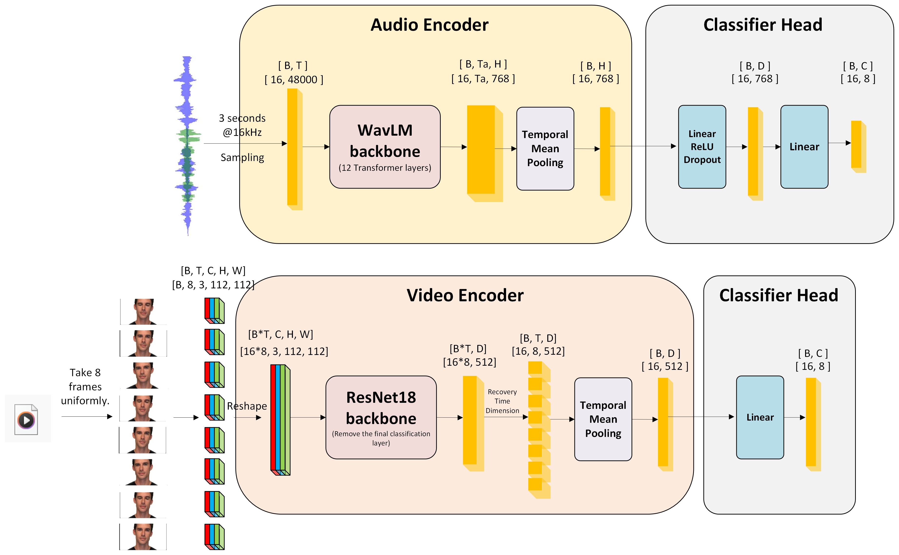

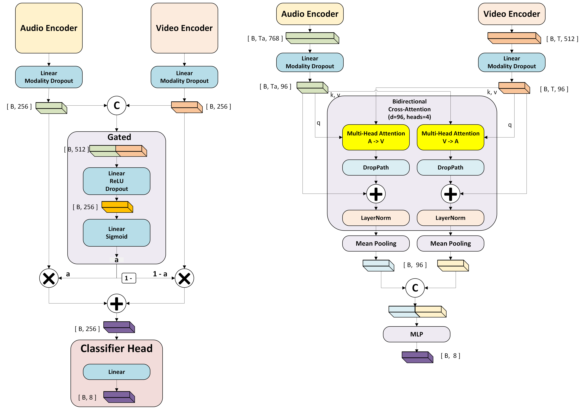

## 可视化展示（PPT/面试可直接使用）

### 1) 处理后数据样例（Audio + Video）

> 保留当前 assets 路径，不改动文件。

<video controls width="720" src="assets/examples/processed_video_example.mp4">
  Your browser does not support the video tag.
</video>

<audio controls src="assets/examples/processed_audio_example.wav">
  Your browser does not support the audio element.
</audio>

备用链接：

- [Processed Video Example](assets/examples/processed_video_example.mp4)
- [Processed Audio Example](assets/examples/processed_audio_example.wav)

### 2) W&B Charts

每张图为 3 次训练曲线叠加（含单模态/多模态对比）。

Train metrics:

| Loss | Accuracy | Macro-F1 |
|---|---|---|
| 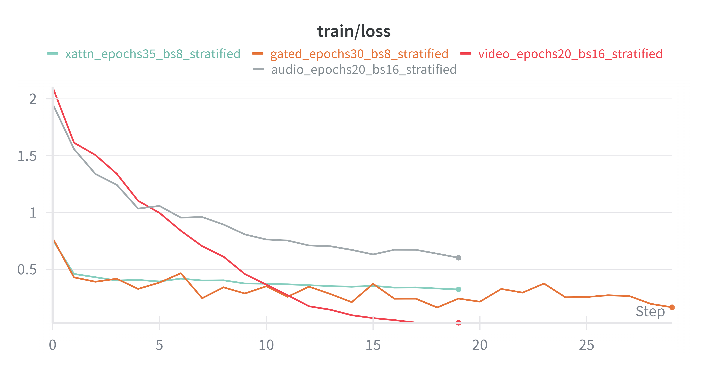 | 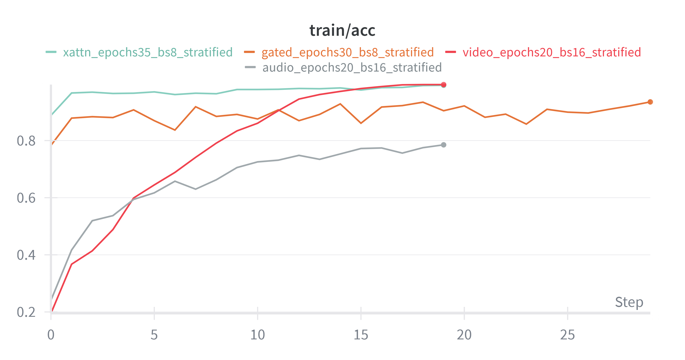 |  |

Validation metrics:

| Loss | Accuracy | Macro-F1 |
|---|---|---|
| 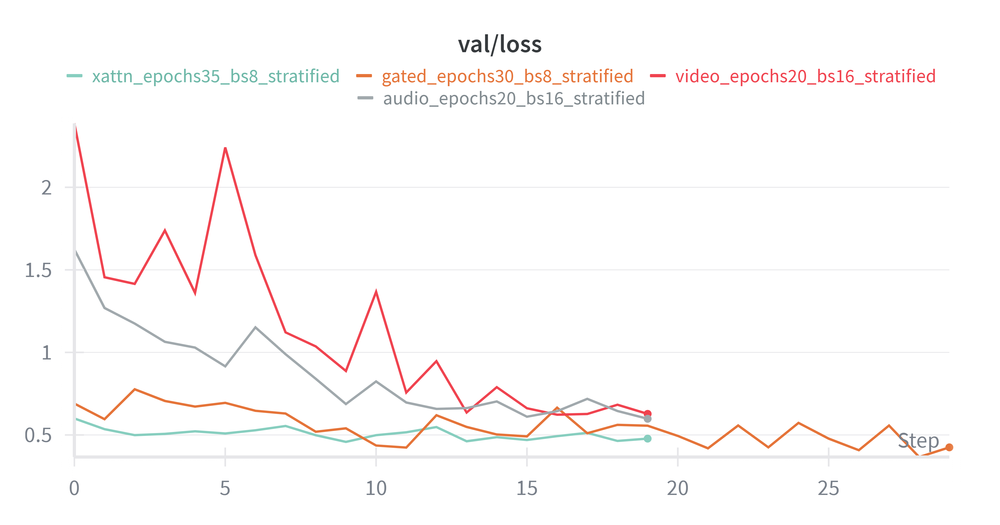 | 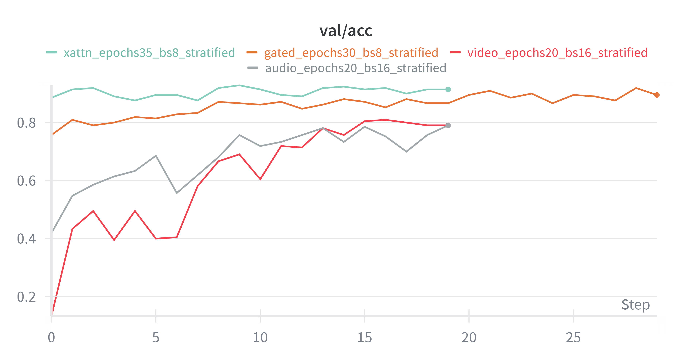 | 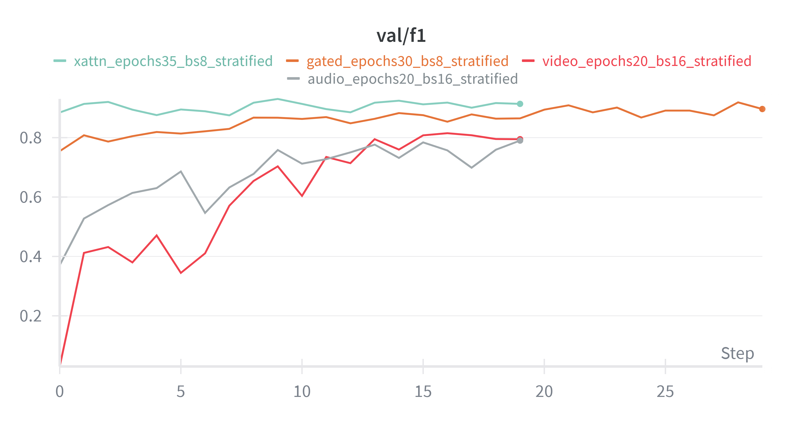 |

Test metrics:

| Loss | Accuracy | Macro-F1 |
|---|---|---|
| 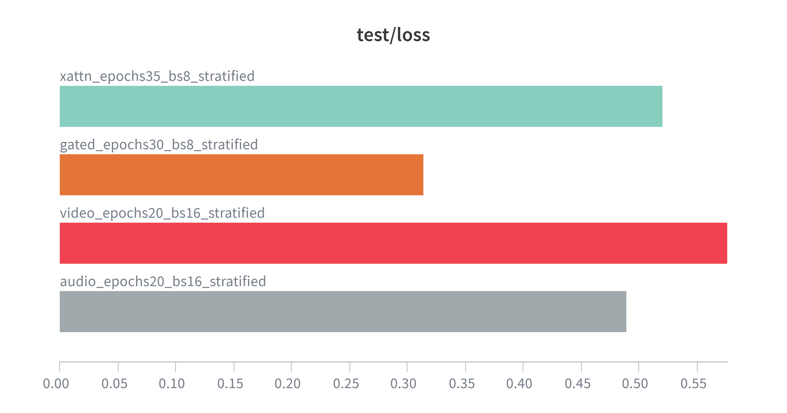 | 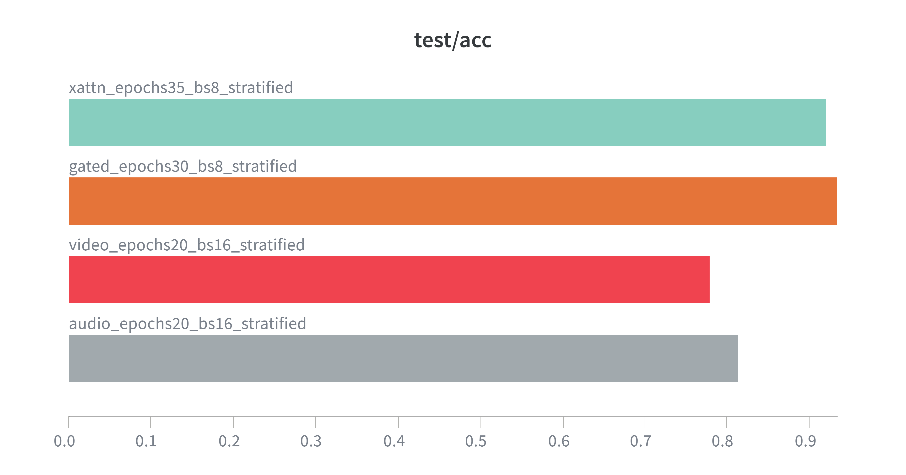 |  |

Confusion matrices:

| Audio | Video | Gated | Xatten
|---|---|---|---|
| 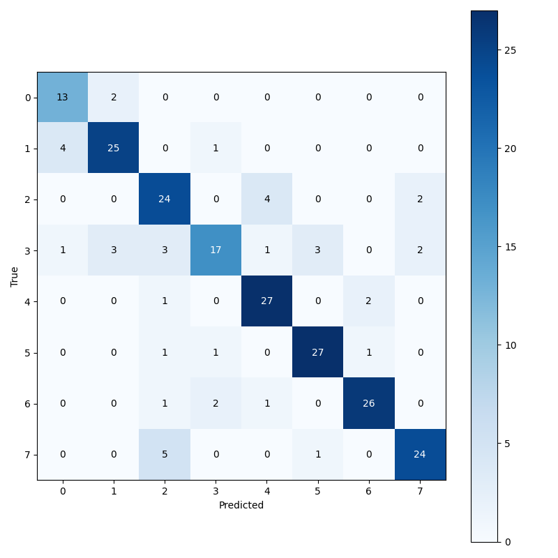 | 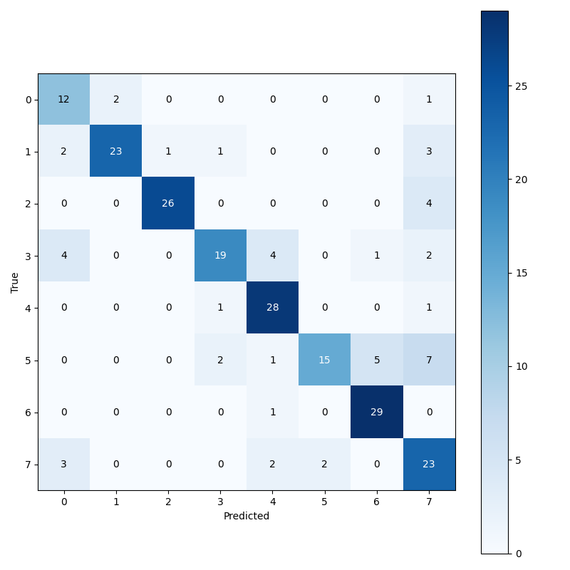 | 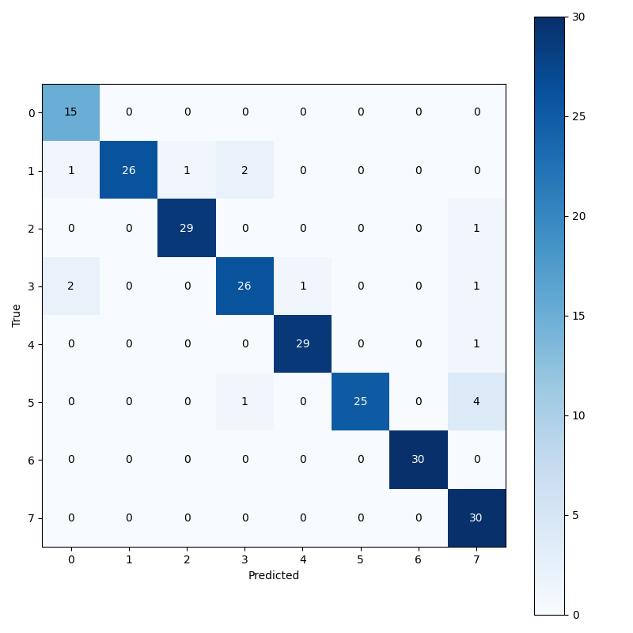 | 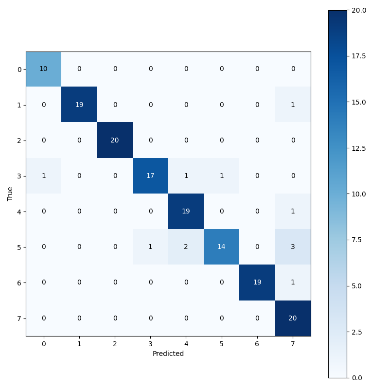


## 数据集

使用：

- RAVDESS dataset

包含：

- 24 actors
- 8 emotion classes
- audio + video paired samples

## 实验结果

Typical performance（示例区间）：

| Model | Test Accuracy |
|---|---:|
| Audio only | ~81% |
| Video only | ~77% |
| Multimodal (gated) | ~93% |
| Multimodal (cross-attention) | ~92% |

Gated fusion 在多次实验中通常达到最佳或并列最佳性能（具体以你的 W&B 结果为准）。

## 技术栈

Framework:

- PyTorch
- FastAPI
- Docker

Models:

- WavLM
- ResNet18

Tools:

- MediaPipe
- Weights & Biases
- ffmpeg

## 项目结构

```text
src/
  models/
  data/
  train.py

backend/
frontend/
checkpoints/
assets/
  examples/
  wandb/
  diagrams/
```

## 推理演示

Web UI:

- Record video -> Predict emotion -> Show probability

API:

```bash
curl -X POST http://localhost:8000/predict
```

## 项目展示能力（面试重点）

本项目展示以下核心能力：

- Multimodal Deep Learning
  - audio-visual fusion
  - cross-attention design
- Deep Learning Engineering
  - model training
  - fine-tuning strategies
- Research Capability
  - architecture design
  - fusion comparison experiments
- Production Deployment
  - inference system
  - Docker deployment

## 作者

Zheyi Liu  
National University of Singapore  
Master of Artificial Intelligence Systems
